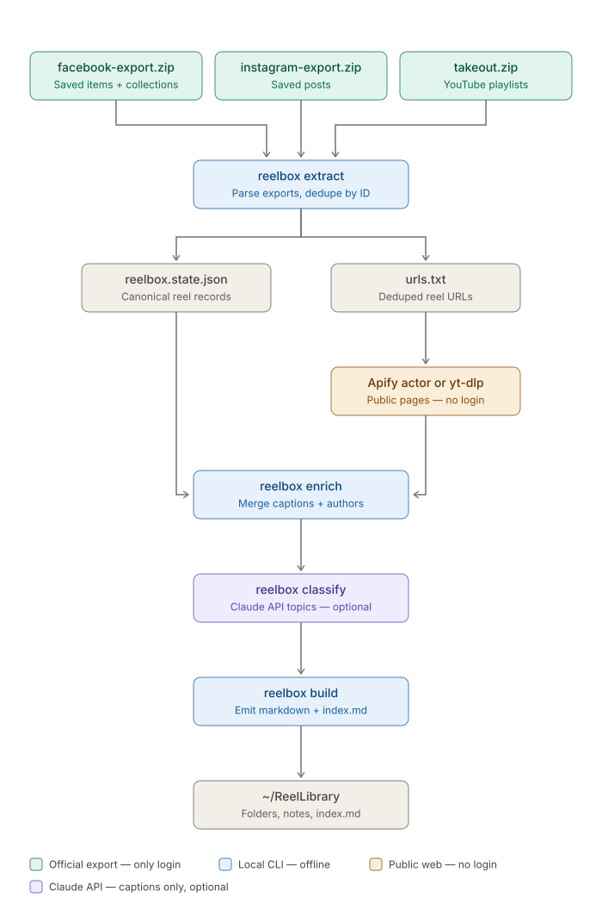

# reelbox

[](https://github.com/pacphi/reelbox-cli/actions/workflows/ci.yml)
[](LICENSE)
[](package.json)
[](package.json)

**Your saved reels, turned into a searchable archive you actually own.**

## The problem

You saved it because it mattered — a recipe, a repair, a route, a joke worth
remembering. Then it went into Facebook's, Instagram's, or YouTube's "Saved"
tab, where it's sorted by nothing, searchable by nothing, and one algorithm
change away from being buried forever. Three platforms, three silos, zero
way to search across them, and no copy of any of it that's actually yours.

## What reelbox does

reelbox turns those saved items into one plain-text library you control:
a Markdown note per reel — caption, author, date, tags — organized into
folders and indexed, ready to open in Obsidian, grep, or sync anywhere.

- **Zero-credential.** reelbox never logs into Facebook, Instagram, or
  YouTube. It only reads the official export files those platforms already
  let you request yourself, plus public (no-login) enrichment data.
- **One CLI, one pipeline.** `extract → enrich → classify → build` — or just
  `reelbox run` to do it all in one shot.
- **Idempotent.** Re-run monthly against fresh exports; only new reels get
  added, nothing gets duplicated or re-processed.
- **Yours.** Plain Markdown + YAML frontmatter on disk — no app, no
  subscription, no lock-in.



## Quick start

```bash
pnpm add -g @pacphi/reelbox-cli   # once published — see docs/RELEASING.md
reelbox run --ig instagram-export.zip --fb facebook-export.zip --yt takeout.zip \
            --enrich apify_dataset.json --out ~/ReelLibrary
```

Full install options (including from-source), where to request each
platform's export, and the complete verb reference live in the docs below.

## Docs

| Doc | For |
|---|---|
| [docs/USAGE.md](docs/USAGE.md) | Requesting platform exports, install, every verb, note format, project layout |
| [CONTRIBUTING.md](CONTRIBUTING.md) | Dev setup, tests, code conventions, PR flow |
| [docs/RELEASING.md](docs/RELEASING.md) | Version/tag/publish process for maintainers |
| [LICENSE](LICENSE) | MIT |

---

MIT licensed. Not affiliated with Meta, Google, or YouTube — reelbox only
reads the export files those platforms already provide you.
